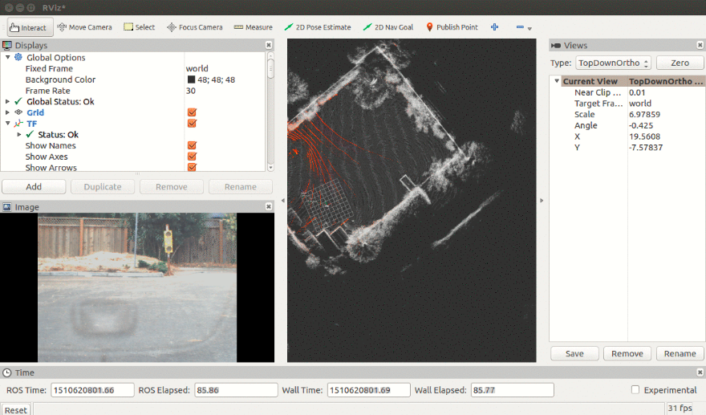

[HeaderImg]: ./resources/images/sossusvlei_head.png "Trees by Sossusvlei Dune 45"

![Header Image][HeaderImg]

### 2018/05/05

## Anthony Maxwell Knight, B.Sc. P.Eng.

[Resume](./resources/resumes/Anthony.Knight.CV.20180506.pdf)

For most of the last year I have been working on Udacity's [`Self Driving Car`](https://www.udacity.com/course/self-driving-car-engineer-nanodegree--nd013) NanoDegree.  I decided to complete this journey after auditing the free [`Artificial Intelligence for Robotics`](https://www.udacity.com/course/artificial-intelligence-for-robotics--cs373) course and partway through completing Udacity's `Intro to Parallel Programming`* which is focussed on CUDA.  The SDC nanodegree intrigued me, as I had always been interested in autonomous control of vehicles.  I enrolled as soon as I could make time for it.  I graduated in April 2018, and now I am interested in finding work in this field. 

Here are some links to projects I completed for the SDC nanodegree

{:class="img-responsive"}{:width="500px"}
[Capstone Project](https://github.com/team-fusionx/CarND-Capstone)

---

{:class="img-responsive"}{:width="500px"}
[Path Planning Project](https://github.com/teeekay/CarND-T3-PathPlanning/blob/master/ModelDocumentation.md)

---

{:class="img-responsive"}{:width="500px"}
[Semantic Segmentation Project](https://github.com/teeekay/CarND-Semantic-Segmentation)

---

{:class="img-responsive"}{:width="500px"}
[Vehicle Detection with CV and SVM Project](https://github.com/teeekay/CarND-Vehicle-Detection/blob/master/Assignment5.TonyKnight.md)

---

[Traffic Sign Classification Project](https://github.com/teeekay/CarND-Traffic-Sign-Classifier-Project/blob/master/Assignment2.TonyKnight.md)

`* Although I can still access CS344, Udacity no longer offers this class.` 
